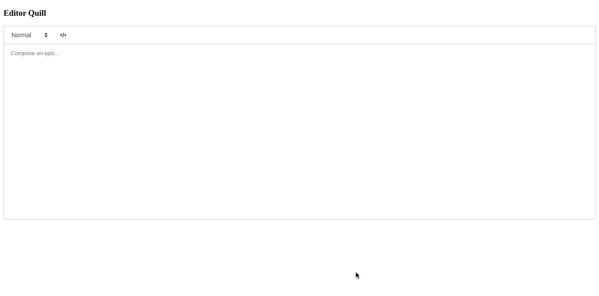

# Editor de Texto utilizando Quill

> Esta implementação foi apenas para testar como funciona essa biblioteca.

## Clonar

- Clone o repostório em questão em sua máquina <https://github.com/cdbarbosa/text-editor-quill.git>

## Executando

- Depois de clonar o repositório, é só abrir o index.html no navegador de preferência
